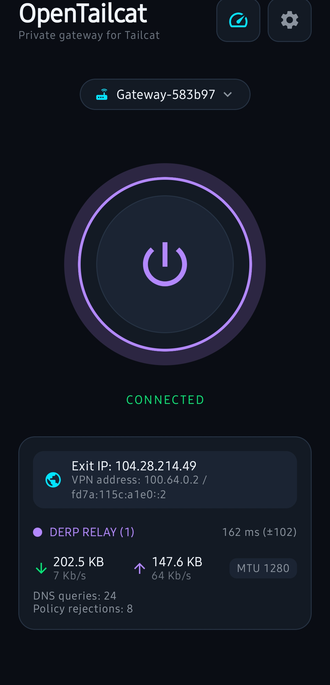
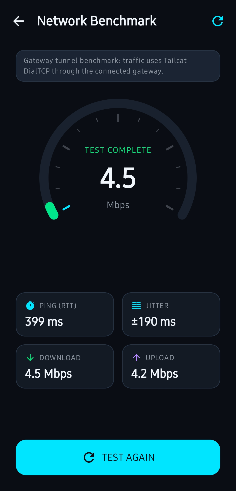

# OpenTailcat

Android client for Tailcat. Paste a `tc…` token and connect to **your** gateway — no control plane in the middle.

> Independent community project. Not affiliated with Tailscale Inc.

## Screenshots

  
  &nbsp;
  

## What’s new in 1.3.7

- Phase 8 **analyzer fix**: Linux SLL2 (`tcpdump -i any`) frames are parsed
  with the correct fixed 20-byte header so probe destinations are detected
  on real gateway captures (`addr_len=0`).
- Phase 8 run log for the 2026-09-23 dual capture (gateway + Colima outer)
  in `handoff.md`; phone-side uplink capture still required for acceptance.
- No data-plane capability promotions; `testRouting: true` unchanged.

## What’s new in 1.3.6

- Speed test **troubleshooter**: failed or slow gateway benchmarks now list
  concrete causes (stale discovery RTT, DERP relay, TCP-only gateway, elevated
  RTT, data-plane drops, dead tunnel health) instead of a silent generic error.
- Stage attribution (ping/download/upload) and private-IP redaction in
  free-form diagnostic text.
- Doc/cleanup pass for 1.3.6; no data-plane capability promotions.

## What’s new in 1.3.5

- The Settings > Apps picker now lists **every app installed on the phone** —
  not only apps with a launcher icon — via `PackageManager.getInstalledApplications`
  and the `QUERY_ALL_PACKAGES` permission, so background/headless apps can be
  excluded too.
- New search field filters the list by app name or package name.

## What’s new in 1.3.4

- Split-tunnel exclusions now work: apps checked under **Settings > Apps**
  bypass the VPN (standard Android `addDisallowedApplication`). Connect no
  longer refuses when the list is non-empty.
- Bypassing apps use the device network directly, so the tunnel is not
  leak-free while any app is checked — the UI says so. With Always-on VPN +
  "Block connections without VPN", Android blocks checked apps entirely.

## What’s new in 1.3.3

- Fixes a networking corruption that could force a stale `200.x` DNS/exit (e.g.
  `200.160.0.8` or an embedded DERP `200.111.5.10`) for ~30s after a failed
  `Connect` — `pendingDNS` is now cleared on `abandonPrepare`
  (`core-engine/lifecycle.go:225`) and the telemetry card no longer shows a
  stale `Exit IP: 200.x` (`TelemetryCard.kt:60` now `isLiveRunning`).
- Still dark theme only; leaner chrome from 1.3.2 remains.

## Install

1. Grab the [latest release](https://github.com/OmarAlaaeldein/OpenTailcat/releases/latest).
2. APKs:
   - **Phone:** `OpenTailcat-1.3.7-arm64-v8a.apk`
   - **Emulator (x86_64):** `OpenTailcat-1.3.7-x86_64.apk`
3. Install it (allow installs from your browser/file manager if asked).
4. Optional: enable **Always-on VPN** and **Block connections without VPN** for OpenTailcat — better if the tunnel drops. Connect still works without them.
5. Paste your `tc…` token and tap Connect.

Checksums are in `OpenTailcat-1.3.7-SHA256SUMS.txt`.

## How it works

You run a Tailcat-compatible exit gateway. It gives you a short token. OpenTailcat uses that token to tunnel to your gateway.

## Notes

- Builds are development-signed unless you set `OPENTAILCAT_RELEASE_*`. Uninstall an older development install if Android blocks the upgrade.
- More detail: [`docs/releases/`](docs/releases/), [`AGENTS.md`](AGENTS.md), [`handoff.md`](handoff.md).

## License

Apache License 2.0 — [LICENSE](LICENSE), [PRIVACY_POLICY.md](PRIVACY_POLICY.md).
