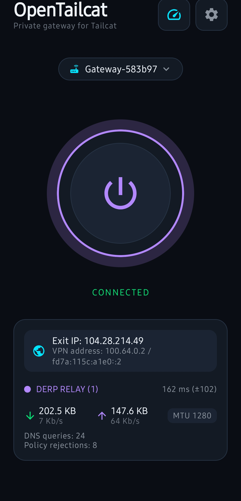
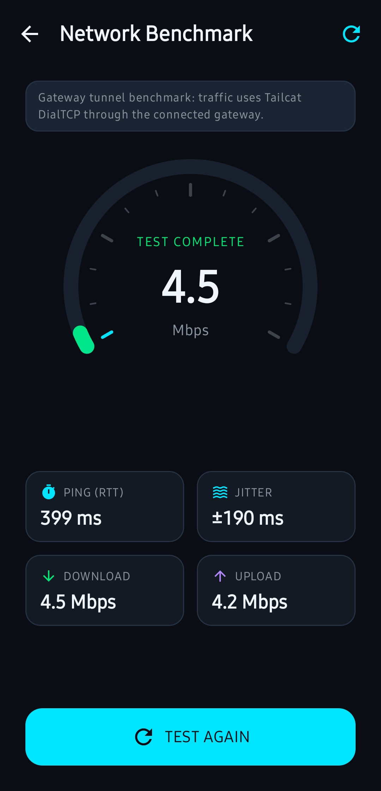

# OpenTailcat

Android client for Tailcat. Paste a `tc…` token and connect to **your** gateway — no control plane in the middle.

> Independent community project. Not affiliated with Tailscale Inc.

## Screenshots

  
  &nbsp;
  

## What’s new in 1.5.1

- **Fail-closed lifecycle fixes**: the new routed interface can no longer be
  cleared by a recycled file descriptor, and `vpnWanted` is stored
  synchronously so a kill cannot resurrect an unwanted VPN.
- **Agreement fixes**: stored profile MTUs are clamped to 1280–1500, token
  IPv4 literals reject leading zeroes like Go and the DNS validator, and
  network-state update failures are logged instead of swallowed.
- **Native engine**: a panicking TCP dial can no longer pin a connection slot
  forever, and `Stop` clears the staged MTU as well as the staged DNS.

Full notes: [`docs/releases/1.5.1.md`](docs/releases/1.5.1.md). Older
releases: [`docs/releases/`](docs/releases/).

## Install

1. Grab the [latest release](https://github.com/OmarAlaaeldein/OpenTailcat/releases/latest).
2. APKs:
   - **Phone:** `OpenTailcat-1.5.1-arm64-v8a.apk`
   - **Emulator (x86_64):** `OpenTailcat-1.5.1-x86_64.apk`
3. Install it (allow installs from your browser/file manager if asked).
4. Optional: enable **Always-on VPN** and **Block connections without VPN** for OpenTailcat — better if the tunnel drops. Connect still works without them.
5. Paste your `tc…` token and tap Connect.

Checksums are in `OpenTailcat-1.5.1-SHA256SUMS.txt`.

## How it works

You run a Tailcat-compatible exit gateway. It gives you a short token. OpenTailcat uses that token to tunnel to your gateway.

## Notes

- Builds are development-signed unless you set `OPENTAILCAT_RELEASE_*`. Uninstall an older development install if Android blocks the upgrade.
- More detail: [`docs/releases/`](docs/releases/), [`AGENTS.md`](AGENTS.md), [`handoff.md`](handoff.md).

## License

Apache License 2.0 — [LICENSE](LICENSE), [PRIVACY_POLICY.md](PRIVACY_POLICY.md).
